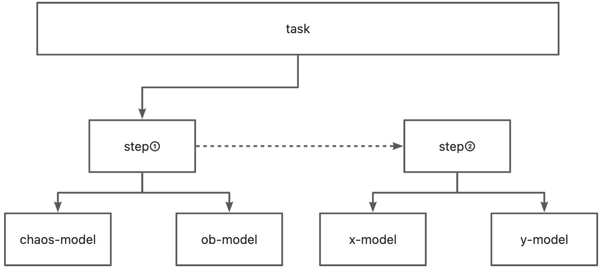

# 前言
ob-open-test是一个基于ob-operator、chaosblade的开源测试工具，其核心为基于K8S环境建设的高可用测试平台。
开源最重要的是可信，一个产品是否能被选用，可靠性测试是极为重要的。OceanBase是一个属于数据库基建的底层应用，其是否稳定、是否高可用于上层业务逻辑强关联。
因此我们设计了ob-open-test来面向OceanBase实现低成本的测试，多场景平台设计。
# 依赖
## kubernetes
kubernetes可以快速搭建已设计的容器，并在生产环境中进行部署，ob-open-test的所有功能性依赖均基于kubernetes设计。
## ob-operator
ob-operator 可以让 OceanBase 以容器的方式，无缝运行在公有云或私有部署的 Kubernetes 集群上。
ob-operator 现已支持 OceanBase 集群的创建、删除，完整的节点生命周期管理，并通过 Service 的形式暴露给用户使用。后续会支持租户管理、ob-proxy 管理、多 Kubernetes 集群等功能。
[https://github.com/oceanbase/ob-operator](https://github.com/oceanbase/ob-operator)

## chaosblade
Chaosblade Operator 是混沌工程实验工具 ChaosBlade 下的一款面向云原生领域的混沌实验注入工具，可单独部署使用。通过定义 Kubernetes CRD 来管理混沌实验，每个实验都有非常明确的执行状态。工具具有部署简单、执行便捷、标准化实现、场景丰富等特点。将 ChaosBlade 混沌实验模型与 Kubernetes CRD 很好的结合在一起，可以实现基础资源、应用服务、容器等场景在 Kubernetes 平台上场景复用，方便了 Kubernetes 下资源场景的扩展，而且可通过 chaosblade cli 统一执行调用。

## gin
Gin 是一个用 Go (Golang) 编写的 Web 框架。用于实现ob-open-test-web模块。


# 安装&卸载
ob-open-test分为服务和单例，方便用户在不同的场景下进行调用。服务倾向于用户自行编排任务执行场景来实现所需的测试场景；单例为我们已设计的场景来执行对应的测试场景。
## 运行环境
ob-open-test做了兼容处理在云内外环境均可，但是由于依赖kubectl来找到对应的集群，因此云外环境需要在对应kubernetes的node上。

## 服务
在kubectl的机器上执行install.sh即可
```shell
chmod +x install.sh
./install.sh
```


## 单例
单例是没有安装及卸载的流程，内部 已包含了所需的依赖及执行步骤
```shell
./{caseName}/run
```

例如：
```shell
go build -o stability ./cmd/stability/stability.go 
chmod +x stability
./stability
```

## 任务
任务创建


## 独立模块调用
例：obcluster

获取当前支持的版本
```shell
curl --location --request GET '127.0.0.1:8080/obcluster/version'
```
创建集群
tag为版本号，上一个版本请求中所对应的值，非必填项，不填时会取第一个版本
```shell
curl --location --request POST '127.0.0.1:8080/obcluster/add' --header 'Content-Type: application/json' \
--data '{    "name":"test",
"tag":”v3.1.4-10000092022071511-1124“
}'
```

获取集群端口
由于集群拉起需要时间，建议在创建集群一分钟后在执行此请求进行端口获取

```shell
curl --location --request POST '127.0.0.1:8080/obcluster/get' --header 'Content-Type: application/json' \
--data '{   "name":"test"}'

```
销毁集群
```shell
curl --location --request POST '127.0.0.1:8080/obcluster/delete' --header 'Content-Type: application/json' \
--data '{   "name":"test"}'
```
# 

# 使用
当前ob-open-test通过http提供服务，后续将支持yaml直接调用
## 单一功能
### 1. ob集群操作
#### 1. 创建集群
此为异步操作，
需要输入集群别名（用于后续的控制）
```shell
curl --location --request POST '127.0.0.1:8080/obcluster/add' --header 'Content-Type: application/json' \
--data '{    "name":"test",
"tag":”v3.1.4-10000092022071511-1124“
}'
```
#### 2. 获取集群信息
未销毁的集群信息会存储在ob-open-test的应用缓存中，可获取对应的集群信息，集群状态
```shell
curl --location --request POST '127.0.0.1:8080/obcluster/get' --header 'Content-Type: application/json' \
--data '{   "name":"test"}'

```
#### 3. 销毁集群
```shell
curl --location --request POST '127.0.0.1:8080/obcluster/delete' --header 'Content-Type: application/json' \
--data '{   "name":"test"}'
```


# 结构
ob-open-test的总体结构如下

## 调度体系

服务调度按task>>steps>model的方式进行

### task设计
task为用户的操作入口，也是整个系统的调度入口，结构如下，主要由任务名，多个步骤结构体，任务状态、创建时间组成。
```go
type Task struct {
    //任务名
    Name       string
    //步骤
    Steps      []Step
    //任务状态
    State      string
    //创建时间
    CreateTime int64
}
```
task主要是面向用户设计的任务编排策略，其包含了基础的start和destory两个方法，后续可接入触发器进行定时触发、条件触发等。可设计场景如代码合并后需要统一执行的一些测试，如设计一个稳定性测试任务、压测任务、基础sql验证任务、模糊测试任务等。任务具有很强的先后顺序，必须满足所有的上一个步骤完成后才可继续触发下一个步骤。
steps为整个任务所需的核心结构表示这个任务需要执行的主要步骤，里面主要是执行具体的步骤，如拉起一个oceanbase集群还需要拉起obproxy集群以及相关的prometheus服务等相关组件，将这些一个个小操作聚合在一起实现为一个步骤。步骤的小操作中先后顺序不强，可同一时间去执行。
```go
type Step struct {
	Name   string
	Type   int
	Models []Model
}
```

model是对各个工具的包装，相当于封装了各个功能将其统一为几个调度接口，可视为SDK的模式
部分统一的方法建议均一进行重写，以适应模块的调度
```go
//组件，包装ob-operator,chaos,workbench
type Model interface {
	//模块名
	GetName() string
	//控制方法命令
	SetConf(map[string]string)
	//开始
	Start()
	//逆向销毁
	Destory()
	//等待时间，用于waitEnd的超时等待命令
	GetStatusTime() time.Duration
	//此处可用context代替
	WaitEnd(timeout time.Duration) int
}
```

ob模块
本模块封装了ob-operator的调用方法，可实现集群的拉起和销毁，后续可根据扩展Confs map内信息来实现对应能力的扩展，不影响其他模块的独立工作
```go
type OBModel struct {
	Name  string
	Confs map[string]string
}
```
chaos模块
本模块封装了chaosblade的调用方法，可实现对ob模块拉起的nampspace的资源操作，通过逐步开放ChaosClient来实现多种混沌测试的场景

```go
type ChaosModel struct {
	Name  string
	Confs map[string]string
	CC    ChaosClient
}
```


# 安全建议

## 关于引用外部地址可能涉及的存在的被攻击的风险

### 1. GetOBServerTagURL

obopentest-ob/OBCluster.go中的获取所有的observer版本信息依赖于从dockerhub内获取对应的版本list，所以需要做一个get请求，若用户觉得存在风险可以自行匹配到内部可控仓库。